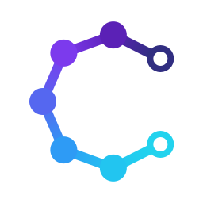

<p align="center">
  
</p>

# Catalyst

[](https://github.com/CajunSystems/catalyst/actions/workflows/ci.yml)

**The Durable AI Execution Runtime for the JVM.**

Catalyst lets you build AI-powered systems that are reliable, resumable, replayable, and
observable. It focuses on **execution semantics**, not prompt engineering — *Temporal meets Git, for
AI execution*, embedded in your JVM process.

Applications don't call models; they **execute AI tasks**. Every important state transition is an
event appended to a durable log, so an execution can crash and resume at the exact step it left off,
be replayed deterministically, and (later) be branched. The log *is* the trace: timelines, token
usage, and cost are folds over events, not a separate instrumentation layer.

Built on the [CajunSystems](https://github.com/CajunSystems) stack: **Gumbo** (a shared, append-only
log) provides durability.

> **Status: v0.1 feature-complete (M0 + M1 + M2).** Durable execute/record/resume; strict,
> self-verifying replay with canonical hashing and a typed token/cost timeline; and branch + diff
> (fork a recorded run, swap the model or a tool result, and diff the trajectories).

---

## What works today (M0 + M1 + M2)

- **`Task` / `Context` API** — a task is a unit of AI work; everything it needs (model, tools,
  memory, effects) comes from the `Context` passed to `execute`.
- **Durable, event-sourced execution** — every boundary (model completion, tool call, effect,
  memory read/write) becomes an event in an append-only log.
- **Crash recovery** — `kill -9` mid-task, re-submit with the same idempotency key, and the
  execution resumes at the exact event and completes with **zero duplicate model calls**.
- **Two storage backends behind one SPI** — an in-memory log for tests, and a durable
  **Gumbo**-backed file log (the flagship embedded mode).
- **`MockModel`** (deterministic, for tests/demos) and built-in **`ClockTool`** / **`CalculatorTool`**.
- **In-doubt boundary policy** — a tool call *or model completion* caught mid-flight by a crash is
  surfaced via a pluggable `InDoubtPolicy` (`RETRY` / `FAIL` / `ASK`) instead of being silently
  re-executed. The model case is the one that costs money: the provider may have produced and billed a
  completion whose result never reached the log, so resuming without a policy pays for it twice.
- **Strict, self-verifying replay (M1)** — `runtime.replay(id, task)` re-runs a recorded execution
  with every boundary substituted and **zero external calls**. Each boundary is checked against the
  log's canonical request hash / tool-input hash / effect label / memory key; a mismatch under
  `ReplayMode.STRICT` throws `NonDeterministicReplayException(seq, expected, actual)`, catching
  nondeterministic task code.
- **Typed timeline + token/cost accounting (M1)** — `runtime.inspect(id).timelineView()` folds the
  log into model/tool call counts, token usage, latency, and cost. Cost is priced by a pluggable
  `CostModel` (e.g. `CostModel.perMillionTokens(in, out)`).
- **Real providers via LangChain4j (M1)** — `LangChain4jModel.of(chatModel)` wraps any LangChain4j
  `ChatModel`, which buys OpenAI, Anthropic, Gemini, Ollama and local models. Catalyst keeps no
  provider HTTP client of its own; the completion flows through `ctx.model()` and is recorded and
  replayed like any other.
- **Branch + diff (M2)** — `runtime.branch(id, atSeq).withModel(other).withRecordedToolResult(name,
  value).run(task)` forks a recorded execution: it substitutes the prefix up to `atSeq` (swapping in
  counterfactual tool results), then runs forward with the new model. Under `ReplayMode.BRANCH` a
  divergence forks (appends `ExecutionBranched`, continues live) instead of throwing.
  `Trajectory.diff(base, fork)` gives the step-by-step difference.
- **Streaming completions (v0.2)** — `ctx.model().stream(request, sink)` delivers a completion's text
  incrementally while recording the assembled result, so a streamed execution writes the same log a
  non-streaming one does and replays with zero provider calls. See
  [Streaming](#streaming-completions).
- **Timeline report (v0.2)** — `TimelineReport.html(runtime.inspect(id))` renders an execution as a
  self-contained HTML page: status, token/cost roll-ups, and the step-by-step trajectory. Read-only and
  post-hoc, so any recorded execution renders. See [Timeline reports](#timeline-reports).
- **Auto-capture (v0.2)** — attach `catalyst-agent` and task code no longer has to wrap its
  nondeterminism: `Instant.now()`, `UUID.randomUUID()`, `Math.random()` and `Random` draws are
  rewritten at their call sites into recorded boundaries, so a task written with plain JDK calls
  replays exactly. See [Auto-capture](#auto-capture-nondeterminism-without-the-ceremony).

Deferred to later milestones (schema slots already reserved so no breaking change is needed):
`WAITING`/signal APIs and human-in-the-loop, snapshots and blob store, distributed execution (v0.2+/v1).

## Module layout

| Module | Responsibility |
|---|---|
| `catalyst-events` | Sealed `CatalystEvent` hierarchy + Jackson serialization (isolated for schema stability) |
| `catalyst-core` | `Task`, `Context`, `Model`/`Tool`/`Memory`/`EventLog` SPIs, the reducer fold, and `ReplayingContext` (record/substitute engine) |
| `catalyst-runtime` | `CatalystRuntime`, virtual-thread scheduler, lifecycle, idempotency, in-memory `EventLog` |
| `catalyst-gumbo` | `GumboEventLog`: durable `EventLog` over the Gumbo shared log |
| `catalyst-tools` | `ClockTool`, `CalculatorTool` |
| `catalyst-langchain4j` | `LangChain4jModel`: adapts any LangChain4j `ChatModel` to Catalyst's `Model` |
| `catalyst-otel` | `CatalystTracer`: folds an execution's log into an OpenTelemetry trace (API-only; app supplies the SDK) |
| `catalyst-timeline` | `TimelineReport`: renders a folded execution as a self-contained HTML timeline (no deps beyond core) |
| `catalyst-agent` | `AutoCaptureAgent`: rewrites the JDK's nondeterministic call sites in task code into recorded boundaries |
| `catalyst-api` | Thin facade: `Catalyst.embedded(path)`, builders, `Serializers` |

Coordinates: `com.cajunsystems:catalyst-*`. Root package `com.cajunsystems.catalyst`. Java 21.

## How Catalyst maps onto Gumbo

Each execution is one Gumbo `LogTag` (`catalyst-exec/<id>`). Gumbo's per-tag `streamVersion` is
Catalyst's dense per-execution `seq` — so every tail read is version-keyed (`readAfterVersion`), never
keyed on the log's global `seqnum`, which only coincides with a stream's own numbering while the log
holds a single execution; a `TypedLogView<CatalystEvent>` handles serialization; and the
idempotency-key → execution index is a durable, tag-scoped key-value store. Swapping the Gumbo
persistence adapter switches between file-backed durability and in-memory — the same SPI a future
Gumbo *cluster* backend will use.

## Building

Requires **JDK 21** and Maven.

Catalyst depends on Gumbo, resolved from [JitPack](https://jitpack.io) — declared in the root pom, so
an ordinary build needs no setup:

```bash
mvn install
```

The coordinate is **`com.github.CajunSystems:gumbo:0.3.0`**, not the `com.cajunsystems:gumbo` that
Gumbo's own pom declares: JitPack rewrites the groupId to `com.github.{owner}` when it publishes, so
which string resolves depends on where the jar came from. Building Gumbo by hand
(`mvn -f gumbo/pom.xml install -DskipTests`) installs it into `~/.m2` under `com.cajunsystems`, which
**this build does not reference** — a local install alone will not satisfy the dependency. If you
need to work from a local Gumbo build (an unreleased change, or an environment that blocks
`jitpack.io`), rewrite the project groupId in your Gumbo checkout's pom to `com.github.CajunSystems`
before installing, so the artifact lands under the coordinate Catalyst asks for.

## The M0 exit demo (crash & resume)

`Demo` tells the `kill -9` story across two real processes:

```bash
CP=$(find . -name 'classes' -type d | tr '\n' ':')$(find ~/.m2 -name 'gumbo-0.3.0.jar' -o -name 'jackson-*-2.17.2.jar' -o -name 'slf4j-*-2.0.12.jar' -o -name 'kryo-*.jar' | tr '\n' ':')

# 1) record the first step, then die abruptly (exit 137 = kill -9), leaving a durable partial log
java -cp "$CP" com.cajunsystems.catalyst.api.Demo /tmp/catalyst-demo record

# 2) resume from the durable log — step 1 is substituted, only step 2 runs live
java -cp "$CP" com.cajunsystems.catalyst.api.Demo /tmp/catalyst-demo resume
```

```
[record] step 1 result: SUMMARY (model calls this run: 1)
[record] simulating kill -9 (exit 137)...
[resume] execution ... -> COMPLETED
[resume] result: SUMMARY|FINAL
[resume] model calls THIS run: 1 (step 1 was substituted from the log; only step 2 ran live)
```

The same scenario is asserted automatically in `M0ResumeAcceptanceTest`.

## The M1 exit demo (strict replay)

`Demo replay` records a complete execution, then replays it with substitution and shows divergence
detection:

```bash
java -cp "$CP" com.cajunsystems.catalyst.api.Demo replay
```

```
[replay] timeline: 2 model call(s), 15 tokens, $0.000069
[replay] replayed -> COMPLETED; external calls during replay: 0
[replay] divergence correctly detected at seq 4
```

Asserted automatically in `M1ReplayAcceptanceTest`.

## The M2 exit demo (branch + diff)

`Demo branch` records a run, forks it at step 1 with a different model, and prints the diff:

```bash
java -cp "$CP" com.cajunsystems.catalyst.api.Demo branch
```

```
[branch] parent ... -> SUMMARY|FINAL
[branch] fork   ... (model swapped from step at seq 4)
[branch] diff (1 step(s) changed):
  [0] PROMPT  SAME
  [1] MODEL  SAME
  [2] PROMPT  SAME
~ [3] MODEL  CHANGED  base={"message":"FINAL",...}  fork={"message":"FINAL-B",...}
```

Asserted automatically in `M2BranchAcceptanceTest`.

## A taste of the API

```java
CatalystRuntime runtime = Catalyst.builder()
        .log(GumboEventLog.at(Path.of("./catalyst-log")))   // durable, embedded
        .model(myModel)
        .build();

Task<String> task = ctx -> {
    String summary = ctx.model().complete(
            CompletionRequest.of(Prompt.builder().user("summarize the document").build())).message();
    return summary.toUpperCase();
};

String result = runtime.execute(task, ExecutionOptions.withKey("doc:42")).result();
```

Re-submitting the same key resumes/attaches to the existing execution instead of starting a new one.

Plug in a real provider by wrapping any LangChain4j `ChatModel` (add `catalyst-langchain4j` and a
LangChain4j provider such as `langchain4j-open-ai`):

```java
ChatModel chat = OpenAiChatModel.builder().apiKey(key).modelName("gpt-4o").build();
CatalystRuntime runtime = Catalyst.builder()
        .log(GumboEventLog.at(Path.of("./catalyst-log")))
        .model(LangChain4jModel.of(chat))
        .costModel(CostModel.perMillionTokens(2.50, 10.00))
        .build();
```

## Streaming completions

A task that wants tokens as they arrive asks for a sink instead of a return value:

```java
Task<String> task = ctx -> {
    StringBuilder assembled = new StringBuilder();
    ctx.model().stream(
            CompletionRequest.of(Prompt.builder().user("describe streaming").build()),
            chunk -> {
                ui.append(chunk);          // incremental delivery
                assembled.append(chunk);
            });
    return assembled.toString();
};
```

Streaming is a **delivery** concern, not a durability one. Whatever the provider does on the wire, the
boundary Catalyst records is the assembled `Completion` — the same single `CompletionReceived` event a
non-streaming call writes. So nothing about resume, replay or branch had to change: a streamed
execution and a non-streamed one are indistinguishable in the log, and the two are interchangeable on
replay. On replay the recorded text is re-emitted to the sink and no provider is contacted.

`Model.stream` is a **default method** — every existing `Model` keeps working, and one that cannot
stream hands the sink the whole message as one chunk. `LangChain4jModel.streaming(streamingChatModel)`
adapts a real streaming provider.

Two things to know:

- **Chunk boundaries are not recorded.** A replay delivers the recorded text in a single chunk.
  Accumulating chunks is safe; branching on *how many* arrived is not, and is the one way streaming can
  make a task nondeterministic. (Token-level replay is deliberately left to a later phase.)
- **The sink runs on the task's thread**, before the boundary is recorded. It must not call
  `ctx.effect`, `ctx.call`, or another completion — that would append an event between this boundary's
  request and its result, which no replay can match.

Asserted automatically in `StreamingAcceptanceTest` and gated in CI by `Demo streaming`.
## Timeline reports

The log already contains everything an execution did, so a timeline is a fold, not an instrumentation
layer. `catalyst-timeline` renders that fold as a page:

```java
ExecutionState state = runtime.inspect(id);
TimelineReport.writeTo(state, Path.of("build/reports/" + id.value() + ".html"));
```

You get a status header, the roll-ups from `timelineView()` (model/tool calls, prompt and completion
tokens, cost, boundary latency, wall clock), and the step-by-step trajectory — each boundary with its
kind, label, offset from start, latency, and recorded payload in a collapsed block.

The design constraints are the interesting part:

- **Read-only and post-hoc**, exactly like the OTel exporter. It consumes an `ExecutionState` and
  installs no runtime hook, so an execution recorded months ago renders just as well as a fresh one.
- **A pure function of the log.** Two renders of the same execution are byte-identical, which is what
  makes a report safe to diff or commit as a build artifact.
- **Self-contained.** Inline CSS, no scripts, no fonts, no images — it opens from a `file://` URL with
  nothing else present, so you can attach one to a ticket.
- **Everything is escaped.** Tool names, effect labels and recorded payloads are log content, and a
  report is likely to be opened by someone other than whoever produced the execution.

The module depends on `catalyst-core` and nothing else: no templating engine, no web server.

Asserted automatically in `TimelineAcceptanceTest` and gated in CI by `Demo timeline`.

## Auto-capture: nondeterminism without the ceremony

Catalyst's determinism contract asks that task code produce the same values on every run. The manual
way to honour it is to route each nondeterministic call through `ctx.effect(...)`:

```java
Task<String> task = ctx -> {
    String stamp = ctx.effect("stamp", () -> Instant.now().toString());
    String id = ctx.effect("id", () -> UUID.randomUUID().toString());
    return stamp + "|" + id;
};
```

Add the `catalyst-agent` module and you can write the same task the way you would write any Java:

```java
public final class StampedReport implements Task<String> {
    @Override public String execute(Context ctx) {
        return Instant.now() + "|" + UUID.randomUUID();   // no ctx.effect, still replayable
    }
}
```

Point the agent at the packages holding your task code, either at launch — using the self-contained
`javaagent`-classified artifact, since a `-javaagent` jar does not get its Maven dependencies:

```bash
java -javaagent:catalyst-agent-<version>-javaagent.jar=packages=com.acme.tasks -cp ... com.acme.Main
```

or from inside the process, which also retransforms classes that are already loaded — this path uses
the ordinary `catalyst-agent` dependency:

```java
AutoCaptureAgent.install(AutoCaptureConfig.forPackages("com.acme.tasks"));
```

Each rewritten call site records its value as an ordinary effect boundary (`auto:Instant.now#0`,
`auto:UUID.randomUUID#1`, …), so resume, replay and branch substitute it like any other. Captured
sources are `Instant.now()` and the other no-argument `java.time` factories,
`System.currentTimeMillis()` / `nanoTime()`, `UUID.randomUUID()`, `Math.random()`, and draws from
`Random` and its relatives (including `ThreadLocalRandom` and `SplittableRandom`). Narrow that with
`sources=time,identity` when a source is not something your task treats as data.

Worth knowing:

- **Packages are opt-in, with no default.** Instrumenting a whole classpath would rewrite library
  internals whose `nanoTime` calls are none of Catalyst's business.
- **Without the agent, nothing changes.** An instrumented class calls the plain JDK method when no
  execution is bound to the thread, so it behaves normally in unit tests and ordinary code.
- **Nondeterminism already inside a boundary is left alone.** A `ctx.effect` supplier or a tool body
  is covered by that boundary's own recorded result.
- **The contract still holds.** Auto-capture removes the bookkeeping, not the discipline: a task
  whose *sequence* of calls varies between runs still diverges, and strict replay still says so.

Asserted automatically in `AutoCaptureAcceptanceTest` and gated in CI by `Demo autocapture`.

## Specification

The full v0.1 design lives in the project spec (Catalyst v0.1 Specification). This repository
implements all three v0.1 milestones — **M0** (execute + record + resume), **M1** (replay + inspect),
and **M2** (branch + diff).

## Roadmap

v0.1 is complete, and v0.2 with it. See [ROADMAP.md](ROADMAP.md) for what's next — v0.2 (shipped:
snapshots, blob store, retry semantics, the OTel exporter, built-in tools, the auto-capture agent,
streaming completions, the timeline report) and v1 (agents, the
`WAITING`/signal APIs and human-in-the-loop via Boudin, distributed execution over a Gumbo cluster,
and the replay-driven eval harness).

## License

MIT — see [LICENSE](LICENSE).
